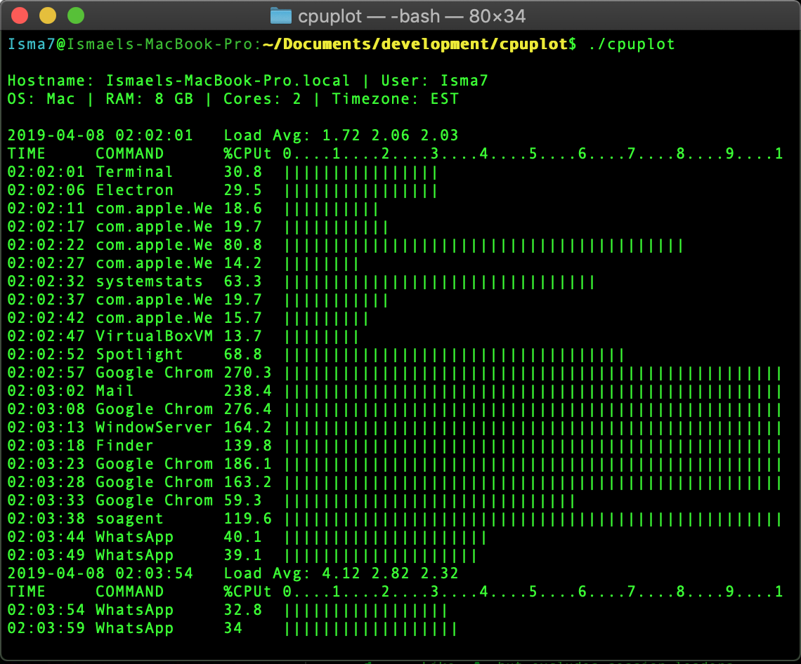

# cpuplot

## Command Line Profiler of CPU Usage and Load Average.

## Synopsis:
BASH script that shows the history of CPU usage, and what procces uses the most CPU at a given time. 

Bar graphs are shown depicting the percentage of Total CPU Usage, and the percentage of Total 1 Minute Load Average.

Default wait interval between system readings is 5secs. But a different one can be passed in the command line with the **-i** argument.  Default output is set for the standard console width of 80 columns, and will show only the bar chart for the CPU usage.  To change this, use the **-w** argument explained below in the "usage" section.

The script detects when the system is in SLEEP mode and shows the "ASLEEP" text.

**Developer: Ismael Antadillas**

## Usage: 
**cpuplot -i [seconds] -w [small medium large xlarge]**

Where:

**-i interval time in seconds between CPU readings.**

**-w width of the output, "small", "medium", "large", "xlarge"**

Example: `cpuplot -i 9   -w xlarge`

The command above will set the time intervals to 9 seconds and shows the plot bars for **total % of CPU usage** and **total % of load average**.

## Acronyms:
**%MEMp** Percentage of RAM memory used by the process.

**%MEMt** Total percentage of RAM memory used.

**%CPUp** Percentage of CPU used by the process.

**%CPUt** Total percentage of CPU being used.

**%LA1m** Percentage of one minute Load Average.

## Calculations:
As described in the man page for the "ps" command:
"The CPU utilization of the process is a decaying average over up to a
minute of previous (real) time.  Because the time base over which this
is computed varies (some processes may be very young), it is possible
for the sum of all %cpu fields to exceed 100%."

Because of the above some values for the "Total CPU Usage" may be over 100%.
When this happens, the bar plot will be truncated to 100%.

The 1 minute Load Average Percentage, is calculated dividing the 1 minute
Load Average by the number of Cores in the system.

## Writing output to a file:
The following command will have the output of cpuplot displayed to the console and also written to a file: 

`cpuplot 2>&1 | tee outputFilename`

## Other screenshots:
Using `cpuplot` with no arguments, will use the default arguments of `-i 5` for 5 seconds intervals, and `-w medium` to show only the plot of cpu usage and fit in a standard 80 column console.

